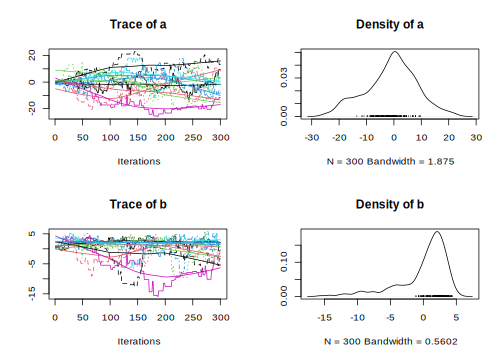

<!-- README.md is generated from README.Rmd. Please edit that file -->

# mcmcensemble

<!-- badges: start -->

[](https://github.com/Bisaloo/mcmcensemble/actions)
[](https://codecov.io/gh/Bisaloo/mcmcensemble?branch=master)
<!-- badges: end -->

This R package provides ensemble samplers for affine-invariant Monte
Carlo Markov Chain, which allow a faster convergence for badly scaled
estimation problems. Two samplers are proposed: the
‘differential.evolution’ sampler from [ter Braak and Vrugt
(2008)](https://doi.org/10.1007/s11222-008-9104-9) and the ‘stretch’
sampler from [Goodman and Weare
(2010)](https://doi.org/10.2140/camcos.2010.5.65).

## Installation

``` r
# install.packages("remotes")
remotes::install_github("Bisaloo/mcmcensemble")
```

## Usage

``` r
library(mcmcensemble)

## a log-pdf to sample from
p.log <- function(x) {
    B <- 0.03                              # controls 'bananacity'
    -x[1]^2/200 - 1/2*(x[2]+B*x[1]^2-100*B)^2
}


## use stretch move
res1 <- MCMCEnsemble(p.log, lower.inits=c(a=0, b=0), upper.inits=c(a=1, b=1),
                     max.iter=3000, n.walkers=10, method="stretch")
#> Using stretch move with 10 walkers.
str(res1)
#> List of 2
#>  $ samples: num [1:10, 1:300, 1:2] 0.14 0.665 0.995 0.653 0.476 ...
#>   ..- attr(*, "dimnames")=List of 3
#>   .. ..$ : chr [1:10] "walker_1" "walker_2" "walker_3" "walker_4" ...
#>   .. ..$ : chr [1:300] "generation_1" "generation_2" "generation_3" "generation_4" ...
#>   .. ..$ : chr [1:2] "a" "b"
#>  $ log.p  : num [1:10, 1:300] -3.59 -3.48 -2.41 -3.44 -2.44 ...
#>   ..- attr(*, "dimnames")=List of 2
#>   .. ..$ : chr [1:10] "walker_1" "walker_2" "walker_3" "walker_4" ...
#>   .. ..$ : chr [1:300] "generation_1" "generation_2" "generation_3" "generation_4" ...
```

If the [coda](https://cran.r-project.org/package=coda) package is
installed, you can then use the `coda = TRUE` argument to get objects of
class `mcmc.list`. The coda package then allows you to call `summary()`
and `plot()` to get informative and nicely formatted results and plots:

``` r
## use stretch move, return samples as 'coda' object
res2 <- MCMCEnsemble(p.log, lower.inits=c(a=0, b=0), upper.inits=c(a=1, b=1),
                     max.iter=3000, n.walkers=10, method="stretch", coda=TRUE)
#> Using stretch move with 10 walkers.

summary(res2$samples)
#> 
#> Iterations = 1:300
#> Thinning interval = 1 
#> Number of chains = 10 
#> Sample size per chain = 300 
#> 
#> 1. Empirical mean and standard deviation for each variable,
#>    plus standard error of the mean:
#> 
#>       Mean    SD Naive SE Time-series SE
#> a -0.99617 9.404  0.17169         1.1082
#> b  0.08097 3.802  0.06941         0.5324
#> 
#> 2. Quantiles for each variable:
#> 
#>     2.5%     25%     50%   75% 97.5%
#> a -20.18 -6.6065 0.01745 5.148 17.65
#> b -10.22 -0.9395 1.25350 2.573  4.29
plot(res2$samples)
```



``` r

## use different evolution move, return samples as 'coda' object
res3 <- MCMCEnsemble(p.log, lower.inits=c(a=0, b=0), upper.inits=c(a=1, b=1),
                     max.iter=3000, n.walkers=10, 
                     method="differential.evolution", coda=TRUE)
#> Using differential.evolution move with 10 walkers.

summary(res3$samples)
#> 
#> Iterations = 1:300
#> Thinning interval = 1 
#> Number of chains = 10 
#> Sample size per chain = 300 
#> 
#> 1. Empirical mean and standard deviation for each variable,
#>    plus standard error of the mean:
#> 
#>      Mean    SD Naive SE Time-series SE
#> a -0.6493 8.119  0.14824          0.631
#> b  1.0218 2.408  0.04397          0.218
#> 
#> 2. Quantiles for each variable:
#> 
#>      2.5%      25%    50%   75%  97.5%
#> a -14.947 -6.59386 -1.001 5.112 16.622
#> b  -5.064 -0.08247  1.645 2.747  4.148
plot(res3$samples)
```


## Similar projects

The methods used in this package also have (independent) implementations
in other languages:

  - emcee in Python (<https://doi.org/10.21105/joss.01864>)
  - gwmcmc in Matlab (<https://github.com/grinsted/gwmcmc>)
