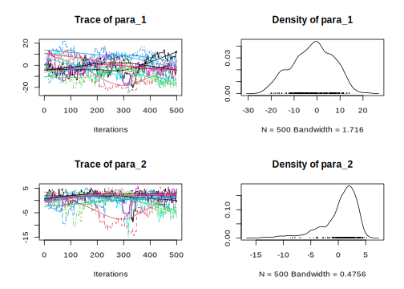
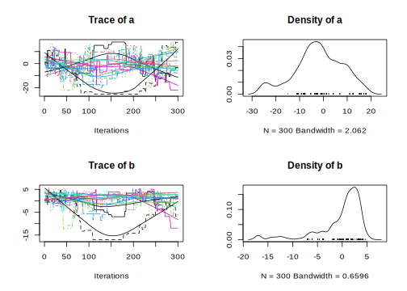

<!-- README.md is generated from README.Rmd. Please edit that file -->

# mcmcensemble

<!-- badges: start -->

[](https://CRAN.R-project.org/package=mcmcensemble)
[](https://github.com/Bisaloo/mcmcensemble/actions)
[](https://codecov.io/gh/Bisaloo/mcmcensemble?branch=master)
[](https://lifecycle.r-lib.org/articles/stages.html)

This R package provides ensemble samplers for affine-invariant Monte
Carlo Markov Chain, which allow a faster convergence for badly scaled
estimation problems. Two samplers are proposed: the
‘differential.evolution’ sampler from [ter Braak and
Vrugt](#ref-terBraak2008) ([2008](#ref-terBraak2008)) and the ‘stretch’
sampler from [Goodman and Weare](#ref-Goodman2010)
([2010](#ref-Goodman2010)).

For theoretical background about Ensemble MCMC (what are the benefits
over simple MCMC? How do they work? What are the pitfalls?), please
refer for example to [this lecture](https://doi.org/10.26207/46za-m573)
from Eric B. Ford (Penn State).

## Installation

You can install the stable version of this package from
[CRAN](https://cran.r-project.org/package=mcmcensemble):

``` r
install.packages("mcmcensemble")
```

or the development version from [GitHub](https://github.com/bisaloo),
via my [r-universe](https://bisaloo.r-universe.dev/):

``` r
install.packages("mcmcensemble", repos = "https://bisaloo.r-universe.dev")
```

## Usage

``` r
library(mcmcensemble)

## a log-pdf to sample from
p.log <- function(x) {
  B <- 0.03 # controls 'bananacity'
  -x[1]^2 / 200 - 1/2 * (x[2] + B * x[1]^2 - 100 * B)^2
}

## set options and starting point
n_walkers <- 10
unif_inits <- data.frame(
  "a" = runif(n_walkers, 0, 1),
  "b" = runif(n_walkers, 0, 1)
)

## use stretch move
res1 <- MCMCEnsemble(p.log, inits = unif_inits,
                     max.iter = 5000, n.walkers = n_walkers,
                     method = "stretch")
#> Using stretch move with 10 walkers.

attr(res1, "ensemble.sampler")
#> [1] "stretch"

str(res1)
#> List of 2
#>  $ samples: num [1:10, 1:500, 1:2] 0.42619 0.45413 0.00133 0.59391 0.35217 ...
#>   ..- attr(*, "dimnames")=List of 3
#>   .. ..$ : chr [1:10] "walker_1" "walker_2" "walker_3" "walker_4" ...
#>   .. ..$ : chr [1:500] "generation_1" "generation_2" "generation_3" "generation_4" ...
#>   .. ..$ : chr [1:2] "a" "b"
#>  $ log.p  : num [1:10, 1:500] -2.8 -3.91 -2.68 -2.93 -2.25 ...
#>   ..- attr(*, "dimnames")=List of 2
#>   .. ..$ : chr [1:10] "walker_1" "walker_2" "walker_3" "walker_4" ...
#>   .. ..$ : chr [1:500] "generation_1" "generation_2" "generation_3" "generation_4" ...
#>  - attr(*, "ensemble.sampler")= chr "stretch"
```

If the [coda](https://cran.r-project.org/package=coda) package is
installed, you can then use the `coda = TRUE` argument to get objects of
class `mcmc.list`. The coda package then allows you to call `summary()`
and `plot()` to get informative and nicely formatted results and plots:

``` r
## use stretch move, return samples as 'coda' object
res2 <- MCMCEnsemble(p.log, inits = unif_inits,
                     max.iter = 5000, n.walkers = n_walkers,
                     method = "stretch", coda = TRUE)
#> Using stretch move with 10 walkers.

attr(res2, "ensemble.sampler")
#> [1] "stretch"

summary(res2$samples)
#> 
#> Iterations = 1:500
#> Thinning interval = 1 
#> Number of chains = 10 
#> Sample size per chain = 500 
#> 
#> 1. Empirical mean and standard deviation for each variable,
#>    plus standard error of the mean:
#> 
#>      Mean    SD Naive SE Time-series SE
#> a -1.9746 8.892  0.12575         1.1049
#> b  0.3599 3.229  0.04566         0.4147
#> 
#> 2. Quantiles for each variable:
#> 
#>      2.5%     25%    50%   75%  97.5%
#> a -19.563 -8.1257 -1.429 4.862 13.448
#> b  -8.809 -0.7837  1.199 2.519  4.225
plot(res2$samples)
```



``` r
## use different evolution move, return samples as 'coda' object
res3 <- MCMCEnsemble(p.log, inits = unif_inits,
                     max.iter = 5000, n.walkers = n_walkers,
                     method = "differential.evolution", coda = TRUE)
#> Using differential.evolution move with 10 walkers.

attr(res3, "ensemble.sampler")
#> [1] "differential.evolution"

summary(res3$samples)
#> 
#> Iterations = 1:500
#> Thinning interval = 1 
#> Number of chains = 10 
#> Sample size per chain = 500 
#> 
#> 1. Empirical mean and standard deviation for each variable,
#>    plus standard error of the mean:
#> 
#>      Mean    SD Naive SE Time-series SE
#> a -0.7293 9.675  0.13683         0.9148
#> b  0.1894 4.103  0.05802         0.4690
#> 
#> 2. Quantiles for each variable:
#> 
#>     2.5%     25%     50%   75% 97.5%
#> a -23.87 -6.4298 -0.2157 6.038 16.33
#> b -13.53 -0.8687  1.6170 2.583  4.22
plot(res3$samples)
```



To see more plotting and MCMC diagnostic options, please refer to the
relevant vignette:
[`vignette("diagnostic-pkgs", package = "mcmcensemble")`](https://bisaloo.github.io/mcmcensemble/articles/diagnostic-pkgs.html)

## Progress bar

You can choose to enable a progress bar thanks to the
[progressr](https://cran.r-project.org/package=progressr) package. This
can be done by adding the following line to your script before running
`MCMCEnsemble()`:

``` r
progressr::handlers(global = TRUE) # requires R >= 4.0
progressr::handlers("progress")

MCMCEnsemble(p.log, inits = unif_inits,
            max.iter = 5000, n.walkers = n_walkers,
            method = "differential.evolution", coda = TRUE)
```

## Parallel processing

This package is set up to allow transparent parallel processing when
requested by the user thanks to the framework provided by the
[future](https://cran.r-project.org/package=future) package. To enable
parallel processing, you must run:

``` r
future::plan("multiprocess")
```

at the start of your session.

## Similar projects

The Goodman-Weare ‘stretch’ sampler is also available in the [tonic R
package](https://github.com/svdataman/tonic).

The methods used in this package also have (independent) implementations
in other languages:

-   [emcee v3: A Python ensemble sampling toolkit for affine-invariant
    MCMC](https://doi.org/10.21105/joss.01864)
-   [GWMCMC which implements the Goodman-Weare ‘stretch’ sampler in
    Matlab](https://github.com/grinsted/gwmcmc)

## Who is talking about this package?

-   [R View from October
    2020](https://rviews.rstudio.com/2020/11/19/october-2020-top-40-new-cran-packages/)

## References

<div id="refs" class="references csl-bib-body hanging-indent">

<div id="ref-Goodman2010" class="csl-entry">

Goodman, Jonathan, and Jonathan Weare. 2010. “Ensemble Samplers with
Affine Invariance.” *Communications in Applied Mathematics and
Computational Science* 5 (1): 65–80.
<https://doi.org/10.2140/camcos.2010.5.65>.

</div>

<div id="ref-terBraak2008" class="csl-entry">

ter Braak, Cajo J. F., and Jasper A. Vrugt. 2008. “Differential
Evolution Markov Chain with Snooker Updater and Fewer Chains.”
*Statistics and Computing* 18 (4): 435–46.
<https://doi.org/10.1007/s11222-008-9104-9>.

</div>

</div>
