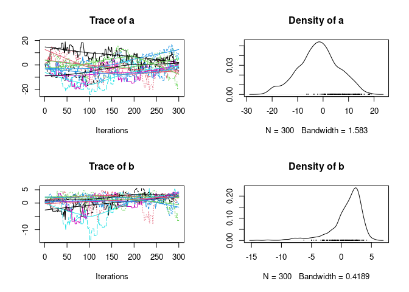

<!-- README.md is generated from README.Rmd. Please edit that file -->

# MCMC Ensemble Sampler

<!-- badges: start -->

[](https://github.com/Bisaloo/MCMCEnsembleSampler/actions)
[](https://codecov.io/gh/Bisaloo/MCMCEnsembleSampler?branch=master)
<!-- badges: end -->

Ensemble Markov Chain Monte Carlo samplers with different strategies to
generate proposals. Either the *stretch move* as proposed by Goodman and
Weare (2010), or a *differential evolution jump move* (similar to Braak
and Vrugt, 2008) is used.

## Installation

``` r
# install.packages("remotes")
remotes::install_github("Bisaloo/MCMCEnsembleSampler")
```

## Usage

``` r
library(MCMCEnsembleSampler)

## a log-pdf to sample from
p.log <- function(x) {
    B <- 0.03                              # controls 'bananacity'
    -x[1]^2/200 - 1/2*(x[2]+B*x[1]^2-100*B)^2
}


## use stretch move
res1 <- MCMCEnsemble(p.log, lower.inits=c(a=0, b=0), upper.inits=c(a=1, b=1),
                     max.iter=3000, n.walkers=10, method="stretch")
#> Using stretch move with 10 walkers.
str(res1)
#> List of 2
#>  $ samples: num [1:10, 1:300, 1:2] 0.187 0.841 0.75 0.759 0.607 ...
#>   ..- attr(*, "dimnames")=List of 3
#>   .. ..$ : chr [1:10] "walker_1" "walker_2" "walker_3" "walker_4" ...
#>   .. ..$ : chr [1:300] "generation_1" "generation_2" "generation_3" "generation_4" ...
#>   .. ..$ : chr [1:2] "a" "b"
#>  $ log.p  : num [1:10, 1:300] -2.04 -3.2 -2.29 -3.57 -2.65 ...
#>   ..- attr(*, "dimnames")=List of 2
#>   .. ..$ : chr [1:10] "walker_1" "walker_2" "walker_3" "walker_4" ...
#>   .. ..$ : chr [1:300] "generation_1" "generation_2" "generation_3" "generation_4" ...
```

If the [coda](https://cran.r-project.org/package=coda) package is
installed, you can then use the `coda = TRUE` argument to get objects of
class `mcmc.list`. The coda package then allows you to call `summary()`
and `plot()` to get informative and nicely formatted results and plots:

``` r
## use stretch move, return samples as 'coda' object
res2 <- MCMCEnsemble(p.log, lower.inits=c(a=0, b=0), upper.inits=c(a=1, b=1),
                     max.iter=3000, n.walkers=10, method="stretch", coda=TRUE)
#> Using stretch move with 10 walkers.

summary(res2$samples)
#> 
#> Iterations = 1:300
#> Thinning interval = 1 
#> Number of chains = 10 
#> Sample size per chain = 300 
#> 
#> 1. Empirical mean and standard deviation for each variable,
#>    plus standard error of the mean:
#> 
#>      Mean    SD Naive SE Time-series SE
#> a -1.7399 7.877  0.14382         0.8178
#> b  0.9125 2.669  0.04874         0.3298
#> 
#> 2. Quantiles for each variable:
#> 
#>     2.5%       25%    50%   75%  97.5%
#> a -18.69 -6.615688 -1.706 3.307 13.055
#> b  -7.01  0.002202  1.567 2.629  4.129
plot(res2$samples)
```



``` r

## use different evolution move, return samples as 'coda' object
res3 <- MCMCEnsemble(p.log, lower.inits=c(a=0, b=0), upper.inits=c(a=1, b=1),
                     max.iter=3000, n.walkers=10, 
                     method="differential.evolution", coda=TRUE)
#> Using differential.evolution move with 10 walkers.

summary(res3$samples)
#> 
#> Iterations = 1:300
#> Thinning interval = 1 
#> Number of chains = 10 
#> Sample size per chain = 300 
#> 
#> 1. Empirical mean and standard deviation for each variable,
#>    plus standard error of the mean:
#> 
#>     Mean    SD Naive SE Time-series SE
#> a -2.678 8.132  0.14847         0.7764
#> b  0.845 2.993  0.05465         0.2791
#> 
#> 2. Quantiles for each variable:
#> 
#>      2.5%      25%    50%   75%  97.5%
#> a -19.745 -8.44280 -2.548 2.914 12.741
#> b  -8.692 -0.02621  1.563 2.927  4.421
plot(res3$samples)
```


## References

  - ter Braak, C. J. F. and Vrugt, J. A. (2008) Differential Evolution
    Markov Chain with snooker updater and fewer chains. Statistics and
    Computing, 18(4), 435–446,
    <https://doi.org/10.1007/s11222-008-9104-9>
  - Goodman, J. and Weare, J. (2010) Ensemble samplers with affine
    invariance. Communications in Applied Mathematics and Computational
    Science, 5(1), 65–80, <https://doi.org/10.2140/camcos.2010.5.65>

## Similar projects

This package also has (independent) implementations in other languages:

  - emcee in Python (<https://doi.org/10.21105/joss.01864>)
  - gwmcmc in Matlab (<https://github.com/grinsted/gwmcmc>)
